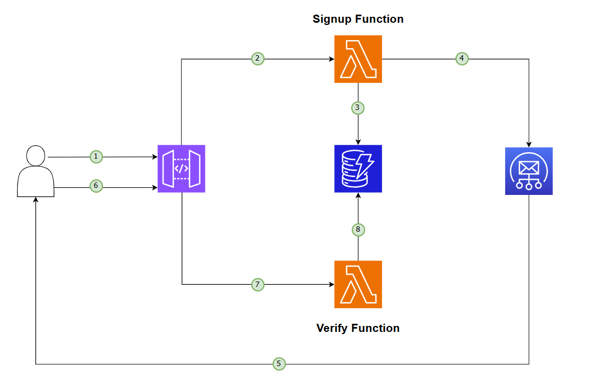
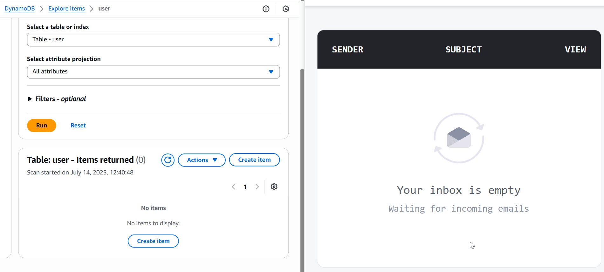
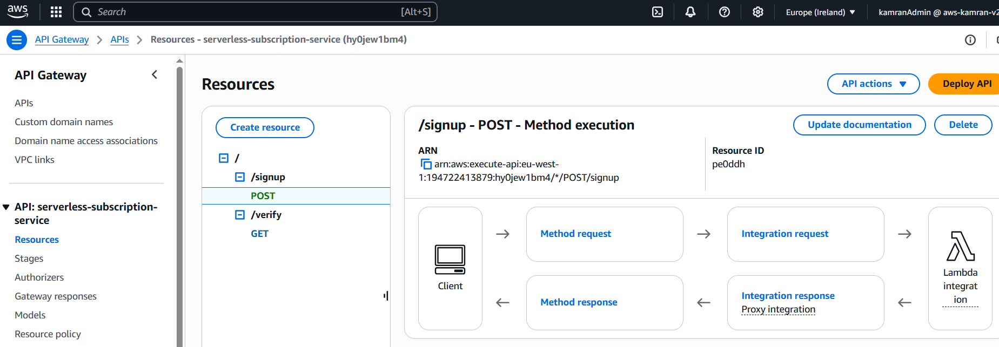
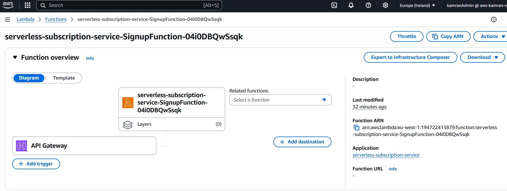
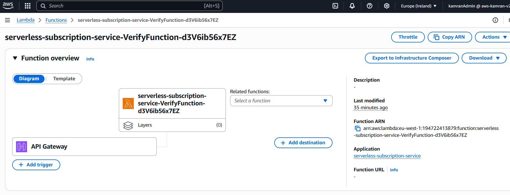
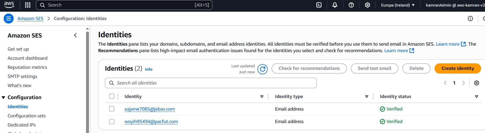

# ☁️ Serverless Subscription Service

[](https://www.oracle.com/java/)
[](https://aws.amazon.com/lambda/)
[](https://aws.amazon.com/api-gateway/)
[](https://aws.amazon.com/dynamodb/)
[](https://aws.amazon.com/ses/)
[](https://aws.amazon.com/serverless/sam/)


> In many apps, platforms, it's essential to collect user emails to send updates, newsletters, or onboarding information.
This project implements a fully serverless email subscription system where users can sign up with their email, receive a verification link, and get added to a subscriber list only after confirming their address.

> Built using AWS Lambda, API Gateway, DynamoDB, and SES — deployed via AWS SAM.

---

## 📚 Table of Contents

- [Tech Stack](#-tech-stack)
- [Features](#-features)
- [Live Demo](#-live-demo)
- [API Endpoints](#-api-endpoints)
- [Secrets & Configs](#-secrets--configs)
- [Deployment (via SAM)](#-deployment-via-sam)
- [Possible Improvements](#-possible-improvements)
- [Screenshots](#-screenshots)
- [Contact](#-contact)

---

## 📌 Tech Stack

- **Language:** Java 17
- **Build Tool:** Maven
- **Cloud Services:**
    - **AWS Lambda** – for serverless compute
    - **Amazon API Gateway** – REST API endpoints
    - **Amazon DynamoDB** – user storage and verification state
    - **Amazon SES** – sends verification emails
    - **AWS SAM** – infrastructure as code (IaC)

---

## ✨ Features

- ✅ Signup with user-provided email
- ✅ UUID-based verification flow via email
- ✅ Fully managed infrastructure (no EC2 or containers)
- ✅ Real email delivery via Amazon SES (sandbox mode)
- ✅ Secure data handling with DynamoDB
- ✅ Token expiration via DynamoDB TTL
- ✅ Easily deployable with AWS SAM CLI

---

## 📊 Architecture Diagram



### 🔁 Flow Summary

1️⃣ User submits email via `POST /signup` to API Gateway.  
2️⃣ API Gateway triggers the **Signup Lambda**.  
3️⃣ The Lambda generates a UUID token and stores it in **DynamoDB** with user email and `verified=false`.  
4️⃣ The same Lambda calls **Amazon SES** to send a verification email.  
5️⃣ User receives an email with a link (`GET /verify?token=...`).  
6️⃣ User clicks the link, which hits API Gateway again.  
7️⃣ API Gateway invokes the **Verify Lambda**.  
8️⃣ The Lambda validates the token and updates `verified=true` in DynamoDB.

---

## 🧭 Live Demo



---

## 🔌 API Endpoints

### `POST /signup`
Subscribe a new email address.

- **Request Body:**
```json
{
  "email": "example@email.com"
}
```

### `GET /verify?token=<uuid>`
Verify email using the token.

- **Success Response:**
```json
{
  "message": "Email verified successfully!"
}
```

- **Failure Response:**
```json
{
  "error": "Invalid or expired token"
}
```

---

## 🔐 Secrets & Configs

| Key              | Description                   | Source             |
|------------------|-------------------------------|--------------------|
| `FROM_EMAIL`     | Verified sender email address |Env Param |
| `REGION`         | AWS Region used               | SAM template       |
| `DYNAMODB_TABLE` | Table storing users           | Created via SAM    |

> 💡 **Note:** SES is in sandbox mode. Only verified emails can receive messages unless production access is granted.

---

## 🚀 Deployment (via SAM)

> ⚙️ **Pre-requisites**:  
> Make sure you have the **AWS CLI** and **AWS SAM CLI** installed and configured locally with appropriate credentials.

```bash
# 1. Build
sam build

# 2. Deploy
sam deploy --guided

```
---

## 📖 Screenshots

### 🚀 API Gateway


### ✅ Lambda - SignupFunction


### 📦 Lambda - VerifyFunction


### 🔔 SES - Sandbox Mode



---

## 🧭 Possible Improvements

- 🔁 Retry logic or fallback using SNS for failed SES delivery
- 📝 Add /status/{email} endpoint to check verification status
- 🔒 Add basic rate-limiting per IP/email

---

## 📬 Contact

Built by **Kamran Zeynalov**

[](https://www.linkedin.com/in/zeynalov-kamran/)

